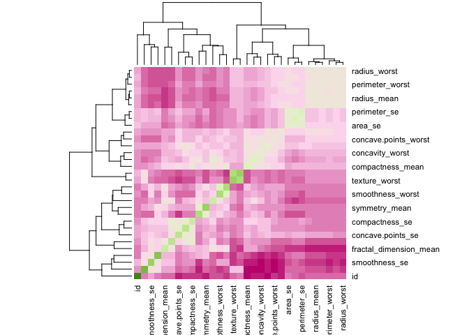
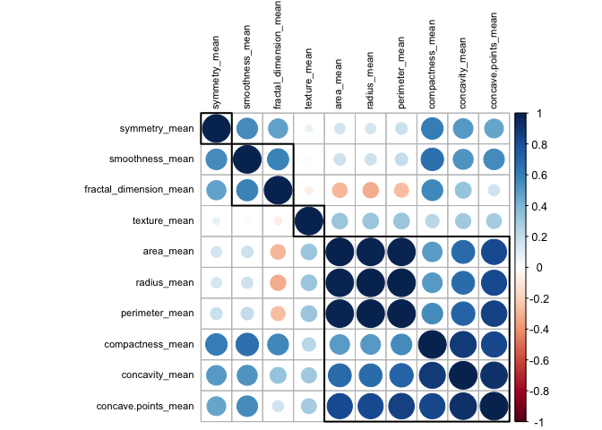
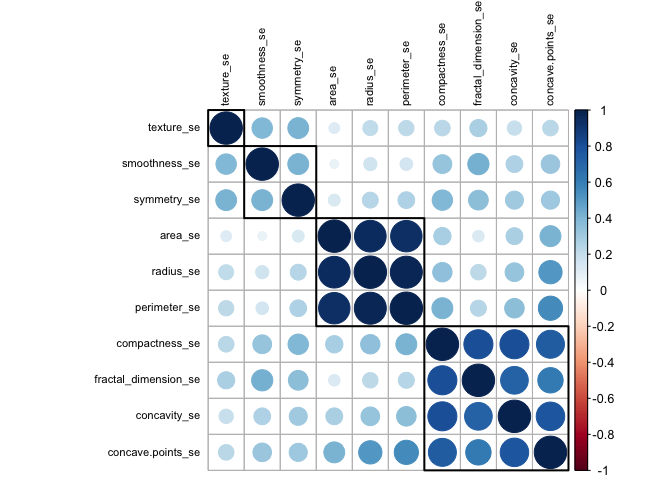
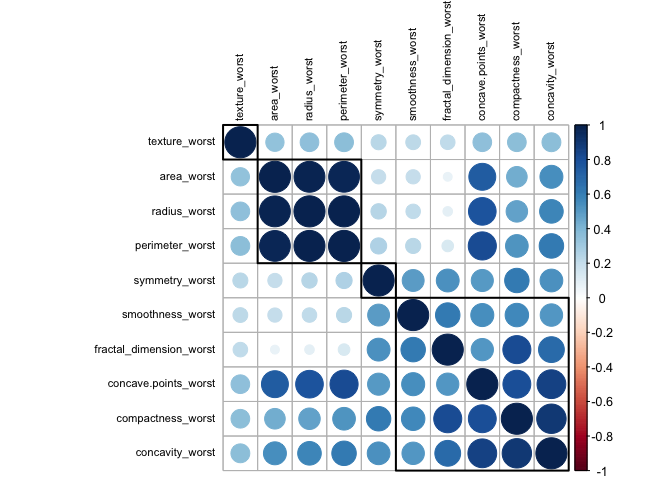
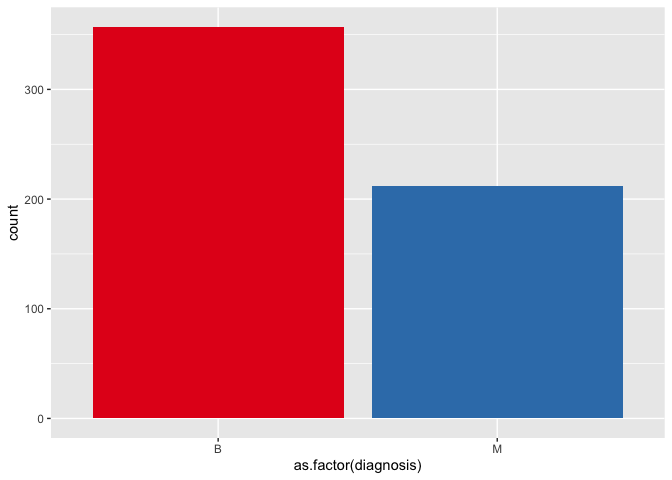
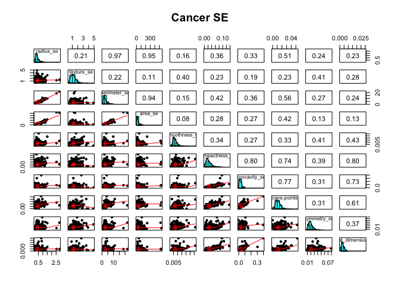
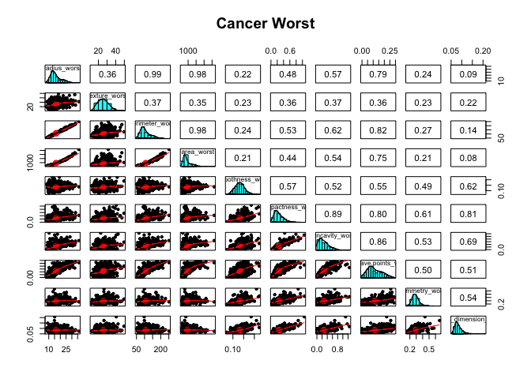
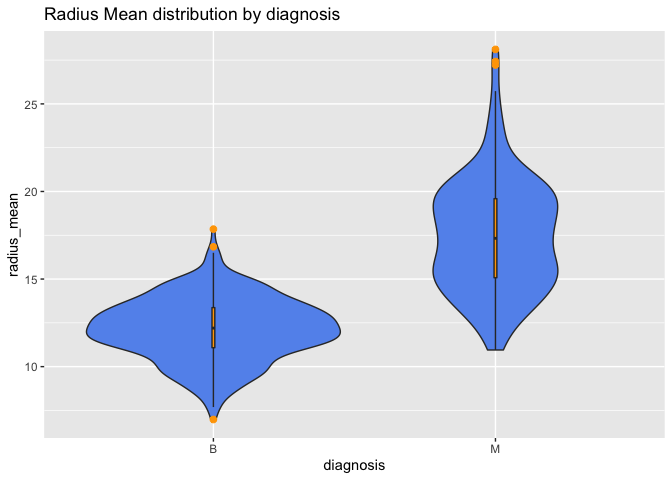
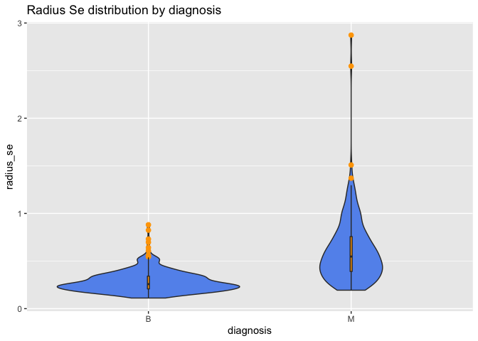
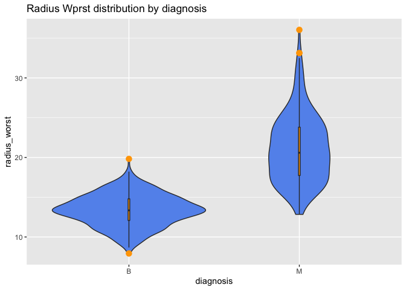

Loding important packages

``` r
library(readr,  warn.conflicts=F)
library(RColorBrewer,  warn.conflicts=F) #Rcolorbrewer palette
library(corrplot,  warn.conflicts=F)
```

    ## corrplot 0.84 loaded

``` r
library(ggcorrplot,  warn.conflicts=F)
```

    ## Loading required package: ggplot2

``` r
library(plotly,  warn.conflicts=F)
library(ggplot2, warn.conflicts=F)
library(reshape, warn.conflicts=F)
library(viridis, warn.conflicts=F)
```

    ## Loading required package: viridisLite

``` r
library(tidyverse, warn.conflicts=F)
```

    ## ── Attaching packages ─────────────────────────────────────── tidyverse 1.3.0 ──

    ## ✓ tibble  3.1.0     ✓ dplyr   1.0.4
    ## ✓ tidyr   1.1.2     ✓ stringr 1.4.0
    ## ✓ purrr   0.3.4     ✓ forcats 0.5.0

    ## ── Conflicts ────────────────────────────────────────── tidyverse_conflicts() ──
    ## x tidyr::expand() masks reshape::expand()
    ## x dplyr::filter() masks plotly::filter(), stats::filter()
    ## x dplyr::lag()    masks stats::lag()
    ## x dplyr::rename() masks reshape::rename(), plotly::rename()

``` r
library(hrbrthemes, warn.conflicts=F)
```

    ## NOTE: Either Arial Narrow or Roboto Condensed fonts are required to use these themes.

    ##       Please use hrbrthemes::import_roboto_condensed() to install Roboto Condensed and

    ##       if Arial Narrow is not on your system, please see https://bit.ly/arialnarrow

``` r
library(psych, warn.conflicts=F)
library(class, warn.conflicts=F)
library(caret, warn.conflicts = F)
```

    ## Loading required package: lattice

``` r
library(DescTools)
```

    ## 
    ## Attaching package: 'DescTools'

    ## The following objects are masked from 'package:caret':
    ## 
    ##     MAE, RMSE

    ## The following objects are masked from 'package:psych':
    ## 
    ##     AUC, ICC, SD

``` r
library(sjPlot)
set.seed(123456789)
```

Importing Dataset

``` r
data <- read.csv("~/Breast-Cancer-Prediction/data/data.csv",  header=T)
```

Looking at dataset

``` r
head(data)
```

    ##         id diagnosis radius_mean texture_mean perimeter_mean area_mean
    ## 1   842302         M       17.99        10.38         122.80    1001.0
    ## 2   842517         M       20.57        17.77         132.90    1326.0
    ## 3 84300903         M       19.69        21.25         130.00    1203.0
    ## 4 84348301         M       11.42        20.38          77.58     386.1
    ## 5 84358402         M       20.29        14.34         135.10    1297.0
    ## 6   843786         M       12.45        15.70          82.57     477.1
    ##   smoothness_mean compactness_mean concavity_mean concave.points_mean
    ## 1         0.11840          0.27760         0.3001             0.14710
    ## 2         0.08474          0.07864         0.0869             0.07017
    ## 3         0.10960          0.15990         0.1974             0.12790
    ## 4         0.14250          0.28390         0.2414             0.10520
    ## 5         0.10030          0.13280         0.1980             0.10430
    ## 6         0.12780          0.17000         0.1578             0.08089
    ##   symmetry_mean fractal_dimension_mean radius_se texture_se perimeter_se
    ## 1        0.2419                0.07871    1.0950     0.9053        8.589
    ## 2        0.1812                0.05667    0.5435     0.7339        3.398
    ## 3        0.2069                0.05999    0.7456     0.7869        4.585
    ## 4        0.2597                0.09744    0.4956     1.1560        3.445
    ## 5        0.1809                0.05883    0.7572     0.7813        5.438
    ## 6        0.2087                0.07613    0.3345     0.8902        2.217
    ##   area_se smoothness_se compactness_se concavity_se concave.points_se
    ## 1  153.40      0.006399        0.04904      0.05373           0.01587
    ## 2   74.08      0.005225        0.01308      0.01860           0.01340
    ## 3   94.03      0.006150        0.04006      0.03832           0.02058
    ## 4   27.23      0.009110        0.07458      0.05661           0.01867
    ## 5   94.44      0.011490        0.02461      0.05688           0.01885
    ## 6   27.19      0.007510        0.03345      0.03672           0.01137
    ##   symmetry_se fractal_dimension_se radius_worst texture_worst perimeter_worst
    ## 1     0.03003             0.006193        25.38         17.33          184.60
    ## 2     0.01389             0.003532        24.99         23.41          158.80
    ## 3     0.02250             0.004571        23.57         25.53          152.50
    ## 4     0.05963             0.009208        14.91         26.50           98.87
    ## 5     0.01756             0.005115        22.54         16.67          152.20
    ## 6     0.02165             0.005082        15.47         23.75          103.40
    ##   area_worst smoothness_worst compactness_worst concavity_worst
    ## 1     2019.0           0.1622            0.6656          0.7119
    ## 2     1956.0           0.1238            0.1866          0.2416
    ## 3     1709.0           0.1444            0.4245          0.4504
    ## 4      567.7           0.2098            0.8663          0.6869
    ## 5     1575.0           0.1374            0.2050          0.4000
    ## 6      741.6           0.1791            0.5249          0.5355
    ##   concave.points_worst symmetry_worst fractal_dimension_worst  X
    ## 1               0.2654         0.4601                 0.11890 NA
    ## 2               0.1860         0.2750                 0.08902 NA
    ## 3               0.2430         0.3613                 0.08758 NA
    ## 4               0.2575         0.6638                 0.17300 NA
    ## 5               0.1625         0.2364                 0.07678 NA
    ## 6               0.1741         0.3985                 0.12440 NA

Columns in dataset

``` r
colnames(data)
```

    ##  [1] "id"                      "diagnosis"              
    ##  [3] "radius_mean"             "texture_mean"           
    ##  [5] "perimeter_mean"          "area_mean"              
    ##  [7] "smoothness_mean"         "compactness_mean"       
    ##  [9] "concavity_mean"          "concave.points_mean"    
    ## [11] "symmetry_mean"           "fractal_dimension_mean" 
    ## [13] "radius_se"               "texture_se"             
    ## [15] "perimeter_se"            "area_se"                
    ## [17] "smoothness_se"           "compactness_se"         
    ## [19] "concavity_se"            "concave.points_se"      
    ## [21] "symmetry_se"             "fractal_dimension_se"   
    ## [23] "radius_worst"            "texture_worst"          
    ## [25] "perimeter_worst"         "area_worst"             
    ## [27] "smoothness_worst"        "compactness_worst"      
    ## [29] "concavity_worst"         "concave.points_worst"   
    ## [31] "symmetry_worst"          "fractal_dimension_worst"
    ## [33] "X"

Checking for null values

``` r
lapply(data,function(x) { length(which(is.na(x)))})
```

    ## $id
    ## [1] 0
    ## 
    ## $diagnosis
    ## [1] 0
    ## 
    ## $radius_mean
    ## [1] 0
    ## 
    ## $texture_mean
    ## [1] 0
    ## 
    ## $perimeter_mean
    ## [1] 0
    ## 
    ## $area_mean
    ## [1] 0
    ## 
    ## $smoothness_mean
    ## [1] 0
    ## 
    ## $compactness_mean
    ## [1] 0
    ## 
    ## $concavity_mean
    ## [1] 0
    ## 
    ## $concave.points_mean
    ## [1] 0
    ## 
    ## $symmetry_mean
    ## [1] 0
    ## 
    ## $fractal_dimension_mean
    ## [1] 0
    ## 
    ## $radius_se
    ## [1] 0
    ## 
    ## $texture_se
    ## [1] 0
    ## 
    ## $perimeter_se
    ## [1] 0
    ## 
    ## $area_se
    ## [1] 0
    ## 
    ## $smoothness_se
    ## [1] 0
    ## 
    ## $compactness_se
    ## [1] 0
    ## 
    ## $concavity_se
    ## [1] 0
    ## 
    ## $concave.points_se
    ## [1] 0
    ## 
    ## $symmetry_se
    ## [1] 0
    ## 
    ## $fractal_dimension_se
    ## [1] 0
    ## 
    ## $radius_worst
    ## [1] 0
    ## 
    ## $texture_worst
    ## [1] 0
    ## 
    ## $perimeter_worst
    ## [1] 0
    ## 
    ## $area_worst
    ## [1] 0
    ## 
    ## $smoothness_worst
    ## [1] 0
    ## 
    ## $compactness_worst
    ## [1] 0
    ## 
    ## $concavity_worst
    ## [1] 0
    ## 
    ## $concave.points_worst
    ## [1] 0
    ## 
    ## $symmetry_worst
    ## [1] 0
    ## 
    ## $fractal_dimension_worst
    ## [1] 0
    ## 
    ## $X
    ## [1] 569

We can notice, that there seems to be three category in dataset.
They’re: mean, se and worst

DATA WRANGLING Deleting X column as it seems to be a mistake while
importing the dataset

``` r
drops <- c("X")
data <- data[ , !(names(data) %in% drops)]
```

``` r
lapply(data,function(x) { length(which(is.na(x)))})
```

    ## $id
    ## [1] 0
    ## 
    ## $diagnosis
    ## [1] 0
    ## 
    ## $radius_mean
    ## [1] 0
    ## 
    ## $texture_mean
    ## [1] 0
    ## 
    ## $perimeter_mean
    ## [1] 0
    ## 
    ## $area_mean
    ## [1] 0
    ## 
    ## $smoothness_mean
    ## [1] 0
    ## 
    ## $compactness_mean
    ## [1] 0
    ## 
    ## $concavity_mean
    ## [1] 0
    ## 
    ## $concave.points_mean
    ## [1] 0
    ## 
    ## $symmetry_mean
    ## [1] 0
    ## 
    ## $fractal_dimension_mean
    ## [1] 0
    ## 
    ## $radius_se
    ## [1] 0
    ## 
    ## $texture_se
    ## [1] 0
    ## 
    ## $perimeter_se
    ## [1] 0
    ## 
    ## $area_se
    ## [1] 0
    ## 
    ## $smoothness_se
    ## [1] 0
    ## 
    ## $compactness_se
    ## [1] 0
    ## 
    ## $concavity_se
    ## [1] 0
    ## 
    ## $concave.points_se
    ## [1] 0
    ## 
    ## $symmetry_se
    ## [1] 0
    ## 
    ## $fractal_dimension_se
    ## [1] 0
    ## 
    ## $radius_worst
    ## [1] 0
    ## 
    ## $texture_worst
    ## [1] 0
    ## 
    ## $perimeter_worst
    ## [1] 0
    ## 
    ## $area_worst
    ## [1] 0
    ## 
    ## $smoothness_worst
    ## [1] 0
    ## 
    ## $compactness_worst
    ## [1] 0
    ## 
    ## $concavity_worst
    ## [1] 0
    ## 
    ## $concave.points_worst
    ## [1] 0
    ## 
    ## $symmetry_worst
    ## [1] 0
    ## 
    ## $fractal_dimension_worst
    ## [1] 0

  
As we can notice now we do not have any missing data  

  
Let’s looking into correlation matrix to see correlation between all the
variables  

``` r
matrixData <- cor(data[sapply(data,is.numeric)], method="pearson")
# Rcolorbrewer palette
coul <- colorRampPalette(brewer.pal(8, "PiYG"))(25)
heatmap(matrixData, scale="column", col = coul)
```

<!-- -->

``` r
corrplot(matrixData, tl.col = "black", order = "hclust", hclust.method = "average", addrect = 4, tl.cex = 0.7)
```

<!-- -->

``` r
#data <- sapply(data,is.numeric)
data.mean <- cor(data[,c(3:12)],method="pearson")
data.se <- cor(data[,c(13:22)],method="pearson")
data.worst <- cor(data[,c(23:32)],method="pearson")


corrplot(data.mean, tl.col = "black", order = "hclust", hclust.method = "average", addrect = 4, tl.cex = 0.7)
```

<!-- -->

``` r
corrplot(data.se, tl.col = "black", order = "hclust", hclust.method = "average", addrect = 4, tl.cex = 0.7)
```

<!-- -->

``` r
corrplot(data.worst, tl.col = "black", order = "hclust", hclust.method = "average", addrect = 4, tl.cex = 0.7)
```

<!-- -->

  

``` r
table(data$diagnosis)
```

    ## 
    ##   B   M 
    ## 357 212

``` r
prop.table(table(data$diagnosis))*100
```

    ## 
    ##        B        M 
    ## 62.74165 37.25835

``` r
ggplot(data, aes(x=as.factor(diagnosis), fill=as.factor(diagnosis) )) + 
  geom_bar( ) +
  scale_fill_brewer(palette = "Set1") +
  theme(legend.position="none")
```

<!-- -->

``` r
pairs.panels(data[,c(3:12)], main="Cancer Mean")
```

<!-- -->

``` r
pairs.panels(data[,c(13:22)], main="Cancer SE")
```

<!-- -->

``` r
pairs.panels(data[,c(23:32)], main="Cancer Worst")
```

<!-- -->

``` r
ggplot(data, aes(x = diagnosis,
y = radius_mean)) + geom_violin(fill = "cornflowerblue") + geom_boxplot(width = .01,
fill = "orange", outlier.color = "orange", outlier.size = 2) +
labs(title = "Radius Mean distribution by diagnosis")
```

<!-- -->

``` r
ggplot(data, aes(x = diagnosis,
y = radius_se)) + geom_violin(fill = "cornflowerblue") + geom_boxplot(width = .01,
fill = "orange", outlier.color = "orange", outlier.size = 2) +
labs(title = "Radius Se distribution by diagnosis")
```

<!-- -->

``` r
ggplot(data, aes(x = diagnosis,
y = radius_worst)) + geom_violin(fill = "cornflowerblue") + geom_boxplot(width = .01,
fill = "orange", outlier.color = "orange", outlier.size = 3) +
labs(title = "Radius Wprst distribution by diagnosis")
```

<!-- -->  
Let’s split the data now to see how tumors differ for M and B  

``` r
dataNew <- split(data, data$diagnosis)
dataB <- dataNew$B
dataM <- dataNew$M
```

  
Now we have two different datasets for B and M  
\#\#\#\#(I will do this work later, I can’t find perfect visualization
technique for this)
