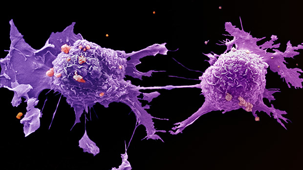
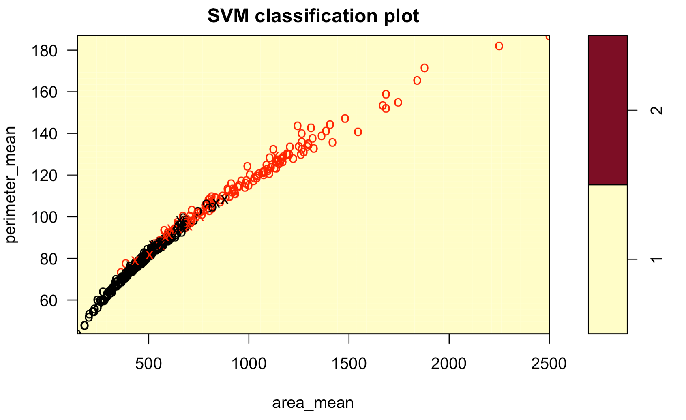
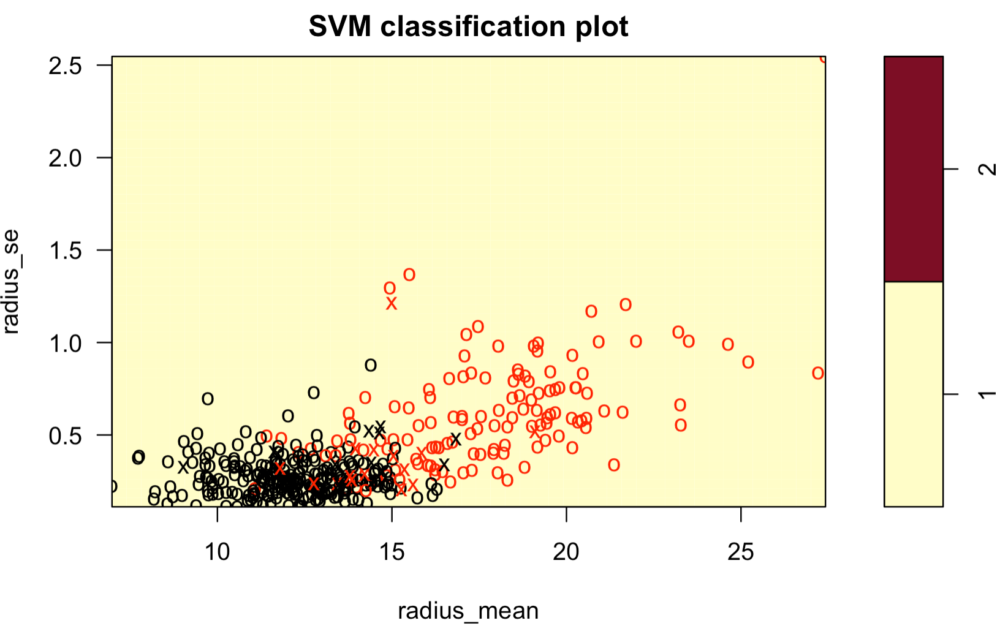
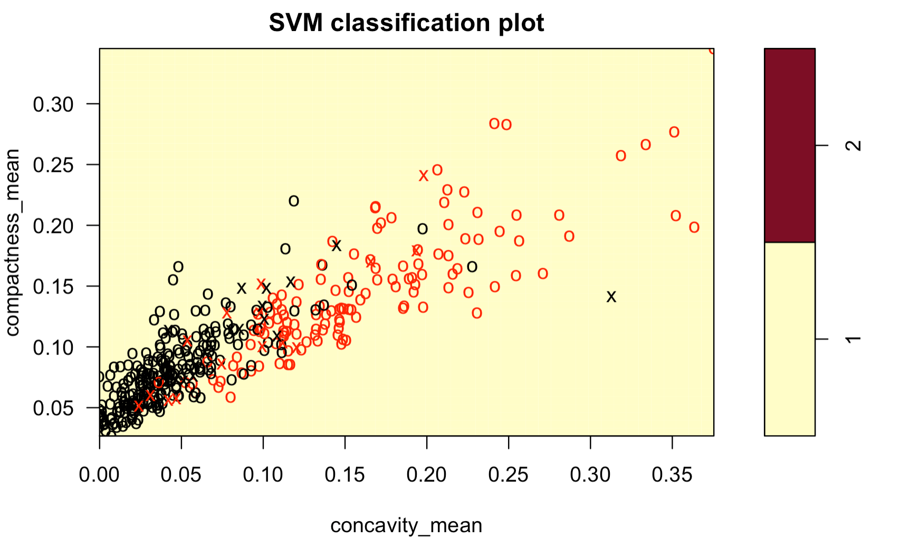
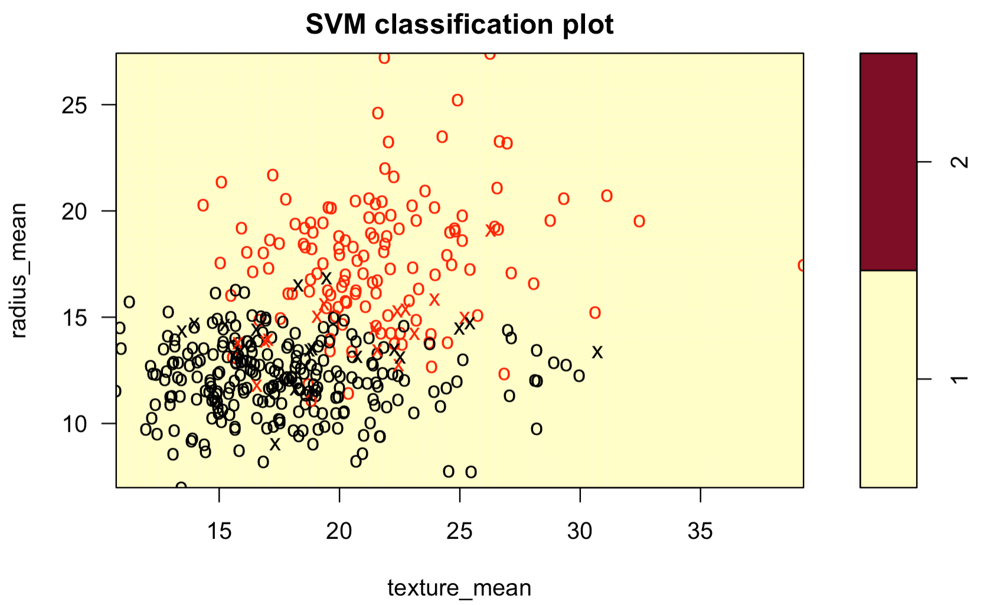
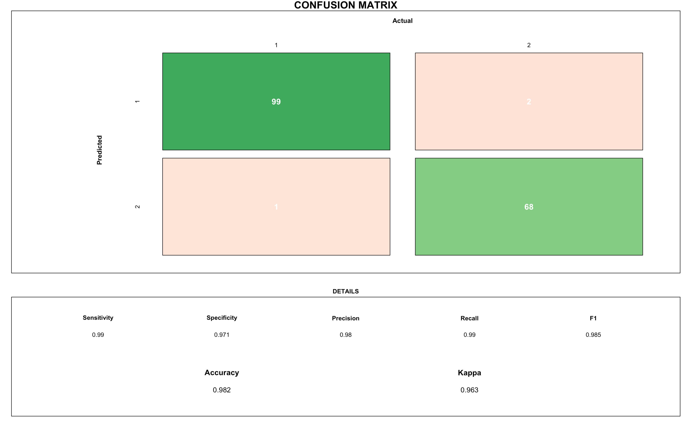

```{r setup, include=FALSE}
library(flexdashboard)
```


```{r , include=FALSE}
library(naniar)
library(knitr)
library(skimr)
library(tidyverse)
library(tidymodels)
library(leaflet)
library(vip)
library(rattle)
library(sf)
library(heatmaply)
library(dash)
library(ggthemes)
library(patchwork)  
library(GGally) 
library(dashCoreComponents)
library(dashHtmlComponents)
library(plotly)
library(readr,  warn.conflicts=F)
library(RColorBrewer,  warn.conflicts=F) #Rcolorbrewer palette
library(corrplot,  warn.conflicts=F)
library(ggcorrplot,  warn.conflicts=F)
library(plotly,  warn.conflicts=F)
library(ggplot2, warn.conflicts=F)
library(reshape, warn.conflicts=F)
library(viridis, warn.conflicts=F)
library(tidyverse, warn.conflicts=F)
library(hrbrthemes, warn.conflicts=F)
library(psych, warn.conflicts=F)
library(class, warn.conflicts=F)
library(caret, warn.conflicts = F)
library(DescTools)
library(sjPlot)
library(kernlab)
library(caret)
library(Matrix)
library(kableExtra)
library(plotly)
library(shiny)
library(maps)
library(tidyverse)
library(skimr)      # skimming data frames
library(ggthemes)
library(patchwork)  # combine separate ggplots into the same graphic
library(GGally)     # ggpairs()
library(corrplot)
library(readr,  warn.conflicts=F)
library(RColorBrewer,  warn.conflicts=F) #Rcolorbrewer palette
library(corrplot,  warn.conflicts=F)
library(ggcorrplot,  warn.conflicts=F)
library(plotly,  warn.conflicts=F)
library(ggplot2, warn.conflicts=F)
library(reshape, warn.conflicts=F)
library(viridis, warn.conflicts=F)
library(tidyverse, warn.conflicts=F)
library(hrbrthemes, warn.conflicts=F)
library(psych, warn.conflicts=F)
library(class, warn.conflicts=F)
library(caret, warn.conflicts = F)
library(DescTools)
library(sjPlot)
library(ggplot2)
library(dplyr)
library(forcats)
library(hrbrthemes)
library(viridis)

set.seed(123456789)
knitr::opts_chunk$set(message = FALSE)
read.csv("data.csv")
data <- read.csv("data.csv", header=T)
lapply(data,function(x) { length(which(is.na(x)))})
drops <- c("X")
data <- data[ , !(names(data) %in% drops)]
lapply(data,function(x) { length(which(is.na(x)))})
palette_ro = c("#ee2f35", "#fa7211", "#fbd600", "#75c731", "#1fb86e", "#0488cf", "#7b44ab")
df_t_m <- as_tibble(scale(select(data, -diagnosis))) %>%
  select(ends_with("_mean")) %>%
  rename_all(~ str_replace_all(., "_mean", "")) %>%
  rename_all(~ str_replace_all(., "_", "\n")) %>%
  rename_all(~ str_replace_all(., " ", "\n")) %>%
  mutate(data["diagnosis"]) %>%
  pivot_longer(col = -diagnosis, names_to = "features", values_to = "value")

df_t_s <- as_tibble(scale(select(data, -diagnosis))) %>%
  select(ends_with("_se")) %>%
  rename_all(~ str_replace_all(., "_se", "")) %>%
  rename_all(~ str_replace_all(., "_", "\n")) %>%
  rename_all(~ str_replace_all(., " ", "\n")) %>%
  mutate(data["diagnosis"]) %>%
  pivot_longer(col = -diagnosis, names_to = "features", values_to = "value")
df_t_w <- as_tibble(scale(select(data, -diagnosis))) %>%
  select(ends_with("_worst")) %>%
  rename_all(~ str_replace_all(., "_worst", "")) %>%
  rename_all(~ str_replace_all(., "_", "\n")) %>%
  rename_all(~ str_replace_all(., " ", "\n")) %>%
  mutate(data["diagnosis"]) %>%
  pivot_longer(col = -diagnosis, names_to = "features", values_to = "value")


```


```{r}
p1 <- df_t_m %>%
  ggplot(aes(fill=diagnosis, y=value, x=features)) + 
    geom_violin(alpha=0.5,width = 1)  +
    xlab("Features") + 
    ylab("Value") +
    ylim(-6,6) +
    theme_minimal(base_size = 12) +
    theme(axis.text.x = element_text(size = 9)) +
    labs(title="Mean values distribution")
fig1 <- ggplotly(p1)


p2 <- df_t_s %>%
  ggplot(aes(fill=diagnosis, y=value, x=features)) + 
    geom_violin(alpha=0.5,width = 1) +
    xlab("Features") +
    ylab("Value") +
    ylim(-13,13) +
    theme_minimal(base_size = 12) +
    theme(axis.text.x = element_text(size = 9)) +
    labs(title="Standard Error values distribution")
fig2 <- ggplotly(p2)

p3 <- df_t_w %>%
ggplot(aes(fill=diagnosis, y=value, x=features)) + 
    geom_violin(alpha=0.5,width = 1 ) +
    xlab("Features") +
    ylab("Value") +
    ylim(-7,7) +
    theme_minimal(base_size = 14) +
    theme(axis.text.x = element_text(size = 9)) +
    labs(title="Worst Value distribution")
fig3 <- ggplotly(p3)


p4 <- df_t_m %>%
ggplot(aes(fill=diagnosis, y=value, x=features)) + 
    geom_jitter(aes(colour = diagnosis)) +
    xlab("Features") +
    ylab("Value") +
    ylim(-7,7) +
    scale_colour_manual(values = c(palette_ro[1], palette_ro[6])) +
    theme_minimal(base_size = 12) +
    theme(axis.text.x = element_text(size = 6)) +
    labs(title="Mean Value distribution")
fig4 <- ggplotly(p4)


p5 <- df_t_s %>%
ggplot(aes(fill=diagnosis, y=value, x=features)) + 
    geom_jitter(aes(colour = diagnosis)) +
    xlab("Features") +
    ylab("Value") +
    ylim(-7,7) +
    scale_colour_manual(values = c(palette_ro[1], palette_ro[6])) +
    theme_minimal(base_size = 12) +
    theme(axis.text.x = element_text(size = 6)) +
    labs(title="Standard Error Value distribution")
fig5 <- ggplotly(p5)

p6 <- df_t_w %>%
ggplot(aes(fill=diagnosis, y=value, x=features)) + 
    geom_jitter(aes(colour = diagnosis)) +
    xlab("Features") +
    ylab("Value") +
    ylim(-7,7) +
    scale_colour_manual(values = c(palette_ro[1], palette_ro[6])) +
    theme_minimal(base_size = 12) +
    theme(axis.text.x = element_text(size = 6)) +
    labs(title="Worst Value distribution")
fig6 <- ggplotly(p6)
```

```{r}
#data <- sapply(data,is.numeric)
data.mean <- cor(data[,c(3:12)],method="pearson")
data.se <- cor(data[,c(13:22)],method="pearson")
data.worst <- cor(data[,c(23:32)],method="pearson")
```

```{r}
corr <- round(cor(data.mean), 1)
corr2 <- round(cor(data.se), 1)
corr3 <- round(cor(data.worst), 1)

# Compute a matrix of correlation p-values
p.mat1 <- cor_pmat(data.mean)
p.mat2 <- cor_pmat(data.se)
p.mat3 <- cor_pmat(data.worst)

corr.plot1 <- ggcorrplot(
  corr, hc.order = TRUE,  type = "upper", outline.col = "white",
  p.mat = p.mat1
  )
corr.plot2 <- ggcorrplot(
  corr2, hc.order = TRUE, type = "upper", outline.col = "white",
  p.mat = p.mat2
  )
corr.plot3 <- ggcorrplot(
  corr3, hc.order = TRUE, type = "upper", outline.col = "white",
  p.mat = p.mat3
  )
```

```{r}
matrixData <- cor(data[sapply(data,is.numeric)], method="pearson")
# Rcolorbrewer palette
coul <- colorRampPalette(brewer.pal(8, "PiYG"))(25)
cor.coef <- cor(matrixData)

# Compute correlation p-values
cor.test.p <- function(x){
    FUN <- function(x, y) cor.test(x, y)[["p.value"]]
    z <- outer(
      colnames(x), 
      colnames(x), 
      Vectorize(function(i,j) FUN(x[,i], x[,j]))
    )
    dimnames(z) <- list(colnames(x), colnames(x))
    z
}
p <- cor.test.p(matrixData)
```


Introduction {.storyboard}
=======================================================================
Introduction {.tabset}
-----------------------------------------------------------------------
In this web report, we aim to understand and explore the Breast Cancer dataset. Our ultimate goal is predict whether a breast mass is benign or malignant. \
Tumors can be benign (noncancerous) or malignant (cancerous). Benign tumors tend to grow slowly and do not spread. Malignant tumors can grow rapidly, invade and destroy nearby normal tissues, and spread throughout the body. \
Cancer begins when healthy cells change and grow out of control, forming a mass or sheet of cells called a tumor. A tumor can be cancerous or benign. A cancerous tumor is malignant, meaning it can grow and spread to other parts of the body. A benign tumor means the tumor can grow but will not spread.\
We're given 30 features in the dataset, that will be used for classification of the beast mass. 
Using exploratory data analysis techniques, we will understand how the dataset is correlated, and find the difference between both breast mass. Ultimately we using predictive modeling algorithms to classify/predict breast cancer. \
We were able to achieve 98.2% accuracy. We used several Support Vector Machine Models to best predict/classify the cancer. \

```{r  out.width = "60%", out.height = "60%"}
 
```

Data {.storyboard}
=======================================================================

### Dataset Description

```{r}
text_tbl <- data.frame(
Variable = c("Diagnosis", "Radius", "Texture", "Perimeter", "Area", "Smoothness", "Compactness", "Concavity", "Concave Points", "Symmetry", "Fractural Dimension"), 
Description = c(
    "M for malignant or B for benign",
    "The mean of three measured distances from center to perimeter",
    "The standard deviation of gray-scale values",
    "The measure of the distance around the boundary of the nuclei",
    "The measure of the surface of the nuclei",
    "The variation in radius lengths",
    "The measure equal to the perimeter squared divided by the area all minus one",
    "The severity of concave portions on the contour",
    "The number of concave portions of the contour",
    "The measure of the likeness across any diameter of the nuclei",
    "The measure of the “coastline approximation” minus one"
) )
kbl(text_tbl, booktabs = T) %>% kable_styling(full_width = F) %>% column_spec(1, bold = T) %>% column_spec(2, width = "35em")

```

***
The data was created by Dr. William H. Wolberg, W. Nick Street, and Olvi L. Mangasarian and then uploaded to Kaggle by Street in 1995. The data set describes characteristics of the cell nuclei of breast mass. The nuclei are seen through digitalized images from a fine needle aspirate (FNA) of a breast mass. FNA is a type of biopsy performed to gain samples of tissue and fluid from breast lesions using a twenty-one to twenty-five gauge needle. It is one of the ways doctors choose to diagnosis breast cancer without removing the mass first.

### Dataset
```{r}
head(data, 50) %>% 
  DT::datatable()
```

### Missing Values in Dataset
```{r}
gg_miss_var(data) + labs(y = "Look at all the missing ones")
```

***

Our dataset didn't have missing values. 

### Diagnosis Distribution
```{r}

renderPlot(
  ggplot(data, aes(x=as.factor(diagnosis), fill=as.factor(diagnosis) )) + 
  geom_bar( ) +
  scale_fill_brewer(palette = "Set1") +
  theme(legend.position="none")
)

```

***

Histogram of both diagnosis counts. 

Correlation Plots {.storyboard}
=======================================================================

### Mean Distribution 
```{r}

renderPlot(
corrplot(data.mean, tl.col = "black", order = "hclust", hclust.method = "average", addrect = 4, tl.cex = 0.7)
)

```


***

We can notice strong correlation between some variables such as radius and parameter, area and concave_point. \
We can also notice that some variables do not have almost any correlation or negative correlation. \
Our corrplot has created. \ 

Our corr plots have used Hierarchical clustering, this makes our corrplot more understandable. We can noitce that the highly correlated variables has been clustered together.  


- Hierarchical clustering, also known as hierarchical cluster analysis, is an algorithm that groups similar objects into groups called clusters. The endpoint is a set of clusters, where each cluster is distinct from each other cluster, and the objects within each cluster are broadly similar to each other.

### Standard Error Distribution 

```{r}
renderPlot(
corrplot(data.se, tl.col = "black", order = "hclust", hclust.method = "average", addrect = 4, tl.cex = 0.7)
)
```

***

We can notice few variables have strong correlation. \
Many variables doesn't have seem to have strong correlation in SE Distribution. 

### Worst Distribution 

```{r}
renderPlot(
corrplot(data.worst, tl.col = "black", order = "hclust", hclust.method = "average", addrect = 4, tl.cex = 0.7)
)
```


***

We can notice strong correlation between some variables but most variables does not seem to be correlated. \
The correlation plot seems to be similar to Standard Error Distribution to some extent. 

Violin Plots {.storyboard}
=======================================================================

### Mean Distribution 
```{r}
renderPlotly(fig1)
```

***

- We can see there are differences in distribution of most variables except for fractal dimension. Fractal dimension seems to be very similar for both. 
- We can notice clear differences in perimeter and concave points.
- For texture, smoothness, and symmetry, the differences are small.

\

Tumors can be benign (noncancerous) or malignant (cancerous). Benign tumors tend to grow slowly and do not spread. Malignant tumors can grow rapidly, invade and destroy nearby normal tissues, and spread throughout the body.


### Standard Error Distribution 
```{r}
renderPlotly(fig2)
```

***

- Many of the differences are difficult to notice. 
- There are many outliers for both benign and malignant.


### Worst Distribution 

```{r}
##Violin plot representing Radius worst distribution by diagnosis
renderPlotly(fig3)
```
 
***

- We can notice difference in distribution for almost all variables and we can notice clear differences in perimeter and concave points.


<style>

    .storyboard-nav .sbframelist {
        margin: 0 auto;
        width: 94%;
        height: 40px;
        overflow: hidden;
        text-shadow: none;
        margin-bottom: 8px;
    }

    .storyboard-nav .sbnext, .storyboard-nav .sbprev {
        float: left;
        width: 2%;
        height: 40px;
        font-size: 40px;
    }

 </style>


Jitter Plots {.storyboard}
=======================================================================
### Mean Distribution 

```{r}
renderPlotly(fig4)
```
 
 ***
 
- We can notice that we have somewhat like a cluster for area, compactness, concave points, cancavity, perimeter and also radius. 
- Fractal dimension seems to be more scattered and we do not notice a clustered data. Similarly Smoothness, symmetry and texture doesn't seem clustered. 

 \

Tumors can be benign (noncancerous) or malignant (cancerous). Benign tumors tend to grow slowly and do not spread. Malignant tumors can grow rapidly, invade and destroy nearby normal tissues, and spread throughout the body.

### Standard Error Distribution
```{r}
renderPlotly(fig5)
```

***
 
- We can notice that we have somewhat like a cluster for area, compactness, concave points, cancavity, perimeter and also radius. 
- Fractal dimension seems to be more scattered and we do not notice a clustered data. Similarly Smoothness, symmetry and texture doesn't seem clustered. 
- Worst and Mean Distribution seems to have somewhat similar distribution. 


### Worst Distribution 
```{r}
renderPlotly(fig6)
```

***
 
- We can notice that we have somewhat like a cluster for area, concavity,  perimeter and also radius. 
- We do not notice a clustered data for most of the features like  Smoothness, symmetry and texture. 

\


Heatmap {.storyboard}
=======================================================================

### Heatmap
```{r}
# Create the heatmap
renderPlotly(heatmaply(matrixData))
```

***

We can notice strong correlation between many variable, which may suggest some multicollinearity issues. 


Support Vector Machine {.storyboard}
=======================================================================

### What is Support Vector Machine? 


```{r  fig.width=5, fig.height=5,echo=FALSE}
include_graphics("svm.png") 
```

***

A Support Vector Machine (SVM) is a supervised machine learning algorithm that can be employed for both classification and regression purposes. SVMs are more commonly used in classification problems and as such, this is what we will focus on in this post.

SVMs are based on the idea of finding a hyperplane that best divides a dataset into two classes, as shown in the image below.
 
Support vectors are the data points nearest to the hyperplane, the points of a data set that, if removed, would alter the position of the dividing hyperplane. Because of this, they can be considered the critical elements of a data set.


SVM Plots {.storyboard}
=======================================================================

### SVM on Cancer Dataset

```{r  out.width = "50%", out.height = "50%",echo=FALSE}
 
 
 
 
```

***

Here are some examples of SVM classification plots on our dataset. SVM classified both tumors benign (noncancerous) or malignant (cancerous) based on each our features. 


Results {.storyboard}
=======================================================================

### Confusion Matrix


```{r  fig.width=5, fig.height=5,echo=FALSE}
 
```


***
We obtained model accuracy of 98.2%, 99% Recall and 98% Precision obtained on test set using Support Vector Machine. 


